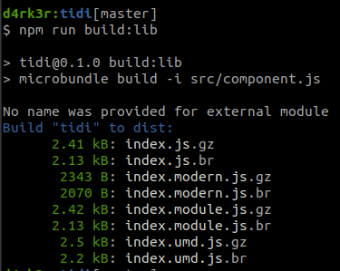
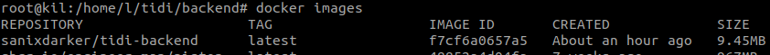
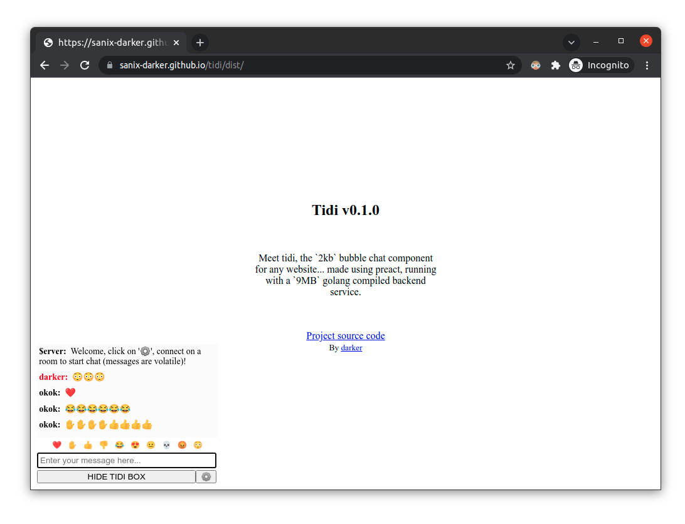

# tidi

Meet tidi, the `2kb` bubble chat component for any website... made using preact, running with a `9MB` golang compiled backend service.

FrontEnd



Backend



## DIsclaimer

I made this project for a specific need who is the need of lite 'live chat' on some platform twitter from a twitter space, the final idea was to come up with a web extension that could be allow to have the chat on any page with the right room, that's why the project was first called ttspch (standign for twitter space chat)... well.., i decided to change it due to the impossible pronounciation thing....




The [DEMO is available HERE](https://sanix-darker.github.io/tidi/dist/), after running the service locally, enter the settings(roomKey and username) and you're good to go...

## Requirements

- node/npm
- go
- Docker (optional for the prod)

## CLI Commands

The backend should be running first before the backend...

### Back End

The service is running on port `:1324`

#### Prod

```bash
# start the docker container
cd backend && make docker-run

# or using pm2 :
# cd backend
# pm2 start --name tidi-backend make -- docker-run
```

### Dev

```bash
# Start the backend app
cd backend && make run
```

### Front End

#### Prod

```bash
# some cleans 
# build npm ready bundles to be consumed by other Preact web apps
# copy the final.html from source to dist
# optional, because you can use the one from this repo directly...
make build

# then run de dist content using serve or http-server
cd dist && http-server
```

#### Dev

``` bash
# install dependencies
npm install

# serve with hot reload at localhost:8080
npm run dev
```

## Author

- [darker](https://github.com/sanix-darker)
