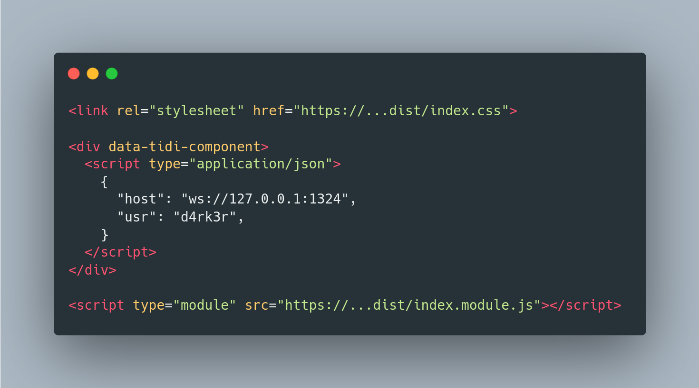
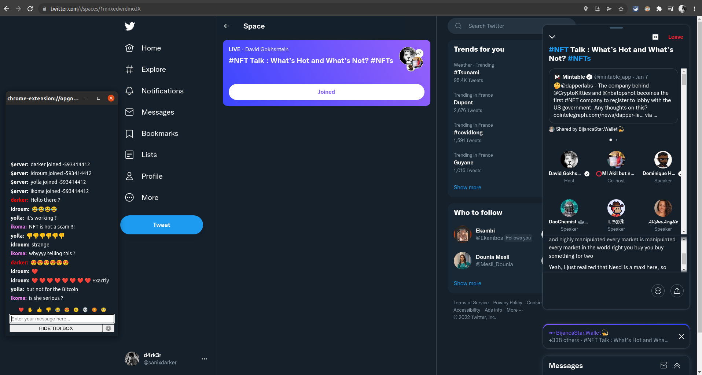

# tidi

Meet tidi, the `2kb` bubble chat component for any website... made using preact, running with a `4MB` compiled backend service.

FrontEnd


Backend


## Disclaimer

I made this project for a specific need, that was a lite 'live chat' on some platform like twitter from the "twitter space" feature, the final idea was then to come up with a web extension that could allow chatting all over the internet with a single roomkey and an username, that's why the project was first called ttspch (standing for twitter space chat)... well.., i decided to change it due to the impossible pronounciation thing....


## Requirements

- node/npm (for dev)
- go (for dev)
- Docker (for the prod)

## CLI Commands

The backend should be running first before the frontend ...

### Back End

#### Prod

```bash
# start the docker container
cd backend && make docker-run

# or using pm2 :
# cd backend
# pm2 start --name tidi-backend make -- docker-run
```

### Dev

```bash
# Start the backend app
cd backend && make run
```

The service should be running on port `:1324`

### Front End

#### Prod

```bash
# This step is optional, because you can use the provided dist resource,
# ths command will install dependencies, build bundles to be consumed
# copy the appropriate html file in dist
make build-dist

# then serve the dist folder with an http server
cd dist && http-server
```

#### Dev

``` bash
# install dependencies
npm install

# serve with hot reload at localhost:8080
npm run dev
```

The app should be accessible on port `:8080`


## Integration

Let say you want to integrate it inside you're application, you will just have to pass to the component, two parameters:
- The Host of the running service
- The Username of the current user




## Xtensions

I managed to make a small test chrome web extension for tidi and it's working pretty fine tho on a NFT twitter space...

Click on the image to whatch the video:

[](https://youtu.be/sSj8BVSP7P4)

## Author

- [darker](https://github.com/sanix-darker)
